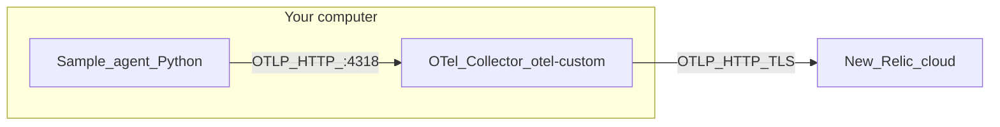

# Beginner guide: sample data → collector → New Relic

This document explains **what each part does** and **in what order you run things**. No prior OpenTelemetry experience required.

---

## The big picture (three boxes)

Think of three programs:

| Piece | What it is | What it does |
|--------|------------|----------------|
| **1. Sample agent** | A small Python program in this repo | Creates **fake** traces, metrics, and logs (like a demo app), and **sends** them out using the standard **OTLP** format over **HTTP** to port **4318**. |
| **2. OpenTelemetry Collector** | A separate program you build (`otel-custom`) | **Listens** on port **4318** for OTLP data, **batches** it, then **forwards** it to backends (here: **New Relic**). It can also **print** data to the terminal for learning (`debug` exporter). |
| **3. New Relic** | A cloud service (your account) | **Receives** OTLP from the collector and shows traces, metrics, and logs in the **New Relic UI**. |



**OTLP** is just the **wire format** OpenTelemetry uses so many tools (agents, collectors, vendors) can speak the same language.

---

## Why not send straight from Python to New Relic?

You *can* in some setups, but using a **collector in the middle** is common because it:

- Lets you **change backends** (Datadog, Grafana, etc.) without changing your app.
- **Batches** and can **filter** data before it leaves your network.
- Matches how many teams run **Kubernetes** or **VM** deployments.

Here, the **Python agent only talks to the collector** on `localhost`. Only the **collector** talks to New Relic (using your **license key** in its config).

---

## Phase A — Learn locally (collector only prints data)

Use this first so you see telemetry on screen **without** a New Relic account.

Use **two terminal tabs or windows** in the **same repo folder**.

**Do not copy placeholders literally.** Docs sometimes say `cd ~/your/path/to/otel-agent` — replace that with **your** clone path (example: `cd ~/extra/otel-agent`). There is **no** folder named `/path/to/otel-agent` on disk.

**Already in the repo?** If your shell prompt already shows `otel-agent`, skip `cd` and run:

```bash
./scripts/run-collector.sh
```

**Human-only lines:** Text like `(wait for “Everything is ready”)` is a reminder for you — **do not paste it into the terminal**. Only paste lines that start with `./`, `python`, `export`, etc.

1. **Install Python deps** (once per machine):

   ```bash
   cd ~/your/path/to/otel-agent
   python3 -m venv .venv
   source .venv/bin/activate
   pip install -r requirements.txt
   ```

2. **Build the collector** (once, or after you change `collector/builder-config.yaml`):

   ```bash
   ./scripts/build-collector.sh
   ```

   Wait until you see a message that the binary was compiled. The program will be at  
   `dist/otel-custom/otel-custom`.

3. **Terminal 1 — start the collector** (leave it running). This script prints a banner so you know which window is which:

   ```bash
   cd ~/your/path/to/otel-agent
   ./scripts/run-collector.sh
   ```

   Wait until you see **“Everything is ready”** and **“Starting HTTP server”** on port **4318**.  
   [`collector/collector-config.yaml`](collector/collector-config.yaml) uses the **debug** exporter: telemetry is **printed** here.

4. **Terminal 2 — run the sample agent** (after Terminal 1 is ready):

   ```bash
   cd ~/your/path/to/otel-agent
   ./scripts/run-agent.sh
   ```

   By default this runs **20 seconds** at **0.5 s** between synthetic requests.  
   Pass your own flags: `./scripts/run-agent.sh --duration 30 --interval 0.3`

   Terminal 2 often stays **quiet** while running — that is normal. Watch **Terminal 1**.

5. **Look at Terminal 1** — you should see dumps of **logs** (`ResourceLog`), **traces** (`ResourceSpans`), and **metrics** (`ResourceMetrics`). That means **agent → collector** is working.

**Manual commands (same flow):**  
`./dist/otel-custom/otel-custom --config=collector/collector-config.yaml` and  
`source .venv/bin/activate && python -m agent --duration 15 --interval 0.5`

---

## Phase B — Send the same data to New Relic

Now the collector **still receives** OTLP on **4318** and sends batches to **New Relic only** (no **debug** stdout — Terminal 1 stays mostly info logs). Use Phase A’s `collector-config.yaml` if you want full telemetry dumps in the terminal.

### Prerequisites (confirm before you run)

| Item | Where to get it |
|------|------------------|
| **Ingest license key** | New Relic UI → API keys / ingest license key (used as `NEW_RELIC_LICENSE_KEY`). Not the same as every “user key” — use what NR documents for OTLP. |
| **Regional OTLP endpoint** | Must match your NR data region. Common defaults (always [verify in NR docs](https://docs.newrelic.com/docs/more-integrations/open-source-telemetry-integrations/opentelemetry/opentelemetry-setup/)): |

| Region (typical) | OTLP base URL (example) |
|------------------|---------------------------|
| US | `https://otlp.nr-data.net` |
| EU | `https://otlp.eu01.nr-data.net` |

Set **`otlphttp/newrelic`** → **`endpoint`** in `collector/collector-config-nr.yaml` to the URL for **your** account.

### Steps

1. **Copy** the example NR config (do not commit secrets):

   ```bash
   cp collector/collector-config-nr.yaml.example collector/collector-config-nr.yaml
   ```

2. **Edit** `collector/collector-config-nr.yaml` if needed:

   - Set **`endpoint`** under `otlphttp/newrelic` to the URL New Relic documents for your region (the example uses the US host).
   - The **`api-key`** line uses `${env:NEW_RELIC_LICENSE_KEY}` so the key stays out of the file.

3. **Export your license key** in the **same shell** where you will start the collector (Terminal 1):

   ```bash
   export NEW_RELIC_LICENSE_KEY="paste-your-ingest-license-key-here"
   ```

4. **Terminal 1 — start the collector with the NR config** (after the `export` above):

   ```bash
   ./scripts/run-collector-nr.sh
   ```

   Or: `./scripts/run-collector.sh collector/collector-config-nr.yaml`  
   (Same as `./dist/otel-custom/otel-custom --config=collector/collector-config-nr.yaml` — the script adds the banner.)

5. **Terminal 2 — sample agent** (after Terminal 1 is ready):

   ```bash
   ./scripts/run-agent.sh --duration 30 --interval 0.5
   ```

6. **In New Relic**, open **APM / OpenTelemetry** or **Logs** (depending on what you use) and look for the service name **`otel-sample-agent`** (or whatever you set with `--service-name`). It may take **1–2 minutes** to appear.

### Convenience script (checks key + config file)

After `collector/collector-config-nr.yaml` exists and you export the key:

```bash
export NEW_RELIC_LICENSE_KEY="your-ingest-license-key"
./scripts/run-collector-nr.sh
```

Same as `./scripts/run-collector.sh collector/collector-config-nr.yaml`, but exits early with a clear message if the env var or yaml file is missing.

### How to verify export to New Relic

1. **Collector log (Terminal 1)**  
   - No repeating **401 / 403 / permanent failure** messages from the **`otlphttp`** exporter toward NR’s host.  
   - Occasional retries under load can be normal; persistent auth errors mean wrong key or headers.

2. **Agent → collector path**  
   - With the NR config you will **not** see **`ResourceSpans`** / **`ResourceMetrics`** / **`ResourceLog`** blocks in Terminal 1. To prove the agent reaches the collector locally, run **Phase A** once with `collector-config.yaml`, or rely on NR UI + absence of receive errors in collector logs.

3. **New Relic UI**  
   - Search for service **`otel-sample-agent`** (or your **`--service-name`**) in OpenTelemetry / APM / logs views **after ~1–2 minutes**.  
   - If nothing appears: wrong **regional endpoint**, invalid **license key**, or NR mapping delay — cross-check [NR OTLP docs](https://docs.newrelic.com/docs/more-integrations/open-source-telemetry-integrations/opentelemetry/opentelemetry-setup/).

---

## Quick reference: who talks to whom

| From | To | Address |
|------|-----|---------|
| Python agent | Collector | `http://localhost:4318` (OTLP HTTP) |
| Collector | New Relic | `https://otlp.nr-data.net` (or your region’s OTLP URL) |

The agent **never** holds your New Relic key; only the **collector config** + **environment variable** do.

---

## If something goes wrong

| Symptom | Likely cause |
|---------|----------------|
| `Connection refused` on port 4318 | Collector is not running, or not started **before** the agent. |
| `8888: address already in use` | Rare now: [`collector-config.yaml`](collector/collector-config.yaml) disables internal Prometheus on **8888**. If you use an **old copied config**, add `service.telemetry.metrics.level: none` or stop the other process: `lsof -i :8888`. |
| `4318: address already in use` | Another **collector** is still running (another terminal or background). **Ctrl+C** in that terminal, or: `pkill -f 'otel-custom.*collector-config'`. The default config uses **only HTTP :4318** (no gRPC :4317), so you should not see `4317` errors unless you re-enabled gRPC in the yaml. |
| `exec format error` running `otel-custom` | Wrong OS binary — run `./scripts/build-collector.sh` again on your machine (the script sets macOS vs Linux). |
| Nothing in New Relic | Wrong **endpoint** or **region**, invalid **license key**, or data still indexing — wait and check NR OTLP docs. |
| Collector log: **`403`** / **`PermissionDenied`** on `otlp.nr-data.net` / **`/v1/metrics`** (or traces/logs) | **Auth or region mismatch.** (1) Use the **Ingest / License** key from New Relic (**API keys**), not a random User key unless [NR OTLP docs](https://docs.newrelic.com/docs/more-integrations/open-source-telemetry-integrations/opentelemetry/opentelemetry-setup/) say otherwise. (2) Put the OTLP **`endpoint`** on the correct **region**: US `https://otlp.nr-data.net`, EU `https://otlp.eu01.nr-data.net`, FedRAMP `https://gov-otlp.nr-data.net`. EU accounts hitting the US host often get **403**. (3) Re-export the key in the **same shell** as the collector (`export NEW_RELIC_LICENSE_KEY=...`), no extra spaces/newlines, then restart `./scripts/run-collector-nr.sh`. |
| `ModuleNotFoundError` for OpenTelemetry | Wrong folder or forgot `source .venv/bin/activate` / `pip install -r requirements.txt`. |

---

## Files worth knowing

| File | Role |
|------|------|
| `agent/main.py` | Builds synthetic traces, metrics, logs and exports OTLP HTTP. |
| `collector/collector-config.yaml` | Collector: receive OTLP → batch → **debug only** (learning). |
| `collector/collector-config-nr.yaml.example` | Template: receive OTLP → batch → **New Relic OTLP only**. |
| `collector/builder-config.yaml` | List of collector components used when **building** `otel-custom`. |
| `scripts/build-collector.sh` | Builds `otel-custom` using Docker (ocb). |
| `scripts/run-collector-nr.sh` | Starts collector with NR config if `NEW_RELIC_LICENSE_KEY` and `collector/collector-config-nr.yaml` exist. |

The NR example omits **debug** so export noise stays low; add **`debug`** back to pipelines temporarily if you want local dumps while still forwarding to NR.
